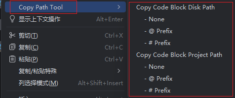

# Copy Path Tool

JetBrains 系列 IDE 的右键路径复制插件：在编辑器中一键复制「文件 / 代码块」的磁盘路径或项目相对路径，专为粘贴到 AI agent 应用（**ZCode、Kimi Work、Qoder Work、WorkBuddy、Trae Work** 等）的对话中作为上下文使用。

## 有什么用

编辑器内右键 → **Copy Path Tool**（菜单位于最顶部），菜单项随选中状态自动切换：

- **未选中代码**：`Copy File Project Path` / `Copy File Disk Path` —— 复制整个文件路径
- **选中代码**：自动变为 `Copy Code Block Project Path` / `Copy Code Block Disk Path` —— 复制带行号的代码块路径，如 `D:/work/demo/src/App.java:12-34`

**未选中代码**，显示 File 分区（整个文件路径）：

**选中代码后**，自动切换为 Code Block 分区（代码块路径 + 行号范围）：

路径统一使用正斜杠（`D:/work/demo/src/App.java`），粘贴到对话中不会被 Markdown 转义。

## 用在哪

- **IDE**：IntelliJ IDEA、PyCharm、GoLand、PhpStorm、WebStorm 等 2024.1 及以上版本（一次开发，全系通用）
- **场景**：AI agent 应用的对话上下文、代码分享、issue/文档中引用代码位置

## 下载

从 GitHub Releases 页面下载最新插件 zip（无需解压）：

**https://github.com/junwindxqw/jetbrains_copy_path_tool/releases**

## 安装

1. 从上方 Releases 页面下载 `jetbrains-copy-path-tool-x.y.z.zip`；
2. 打开 IDE → `Settings` → `Plugins` → 右上角 **⚙** → **Install Plugin from Disk...** → 选择下载的 zip；
3. 重启 IDE。每个需要使用的 IDE 分别安装一次。

> 已在 PhpStorm 2026.2.1 与 WebStorm 2026.1.1 上完成真机验证。
